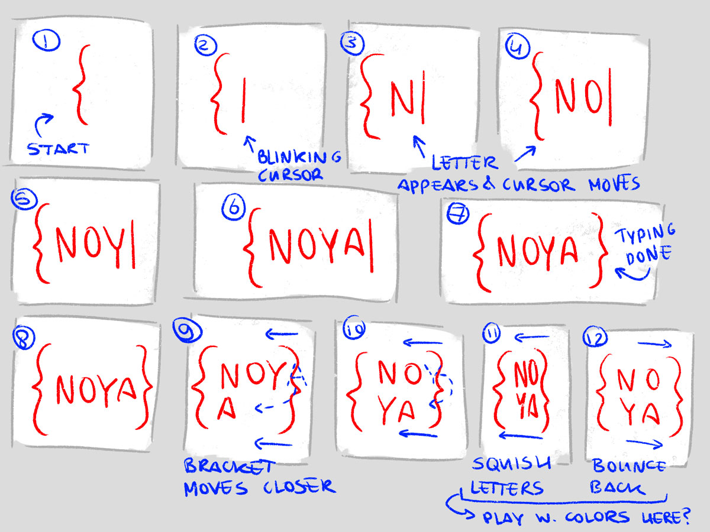
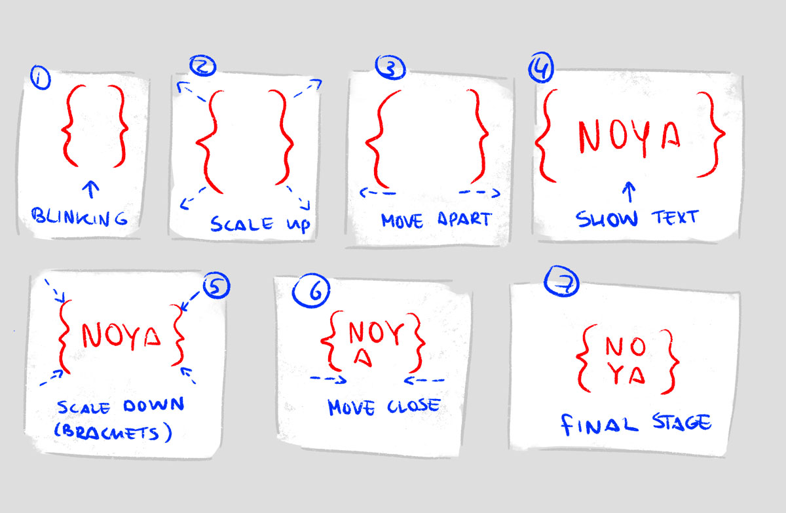
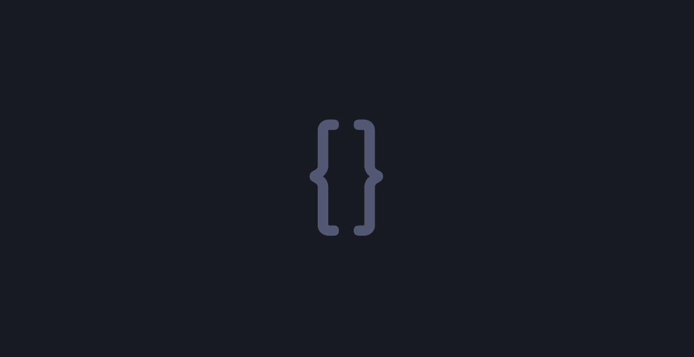
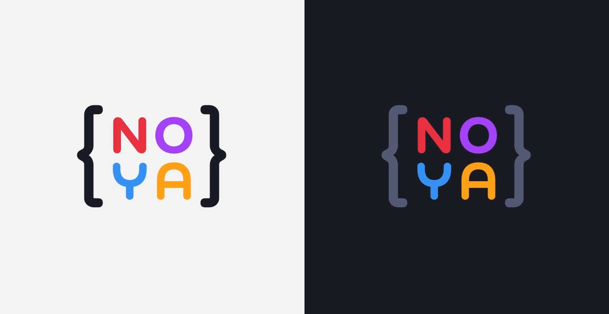
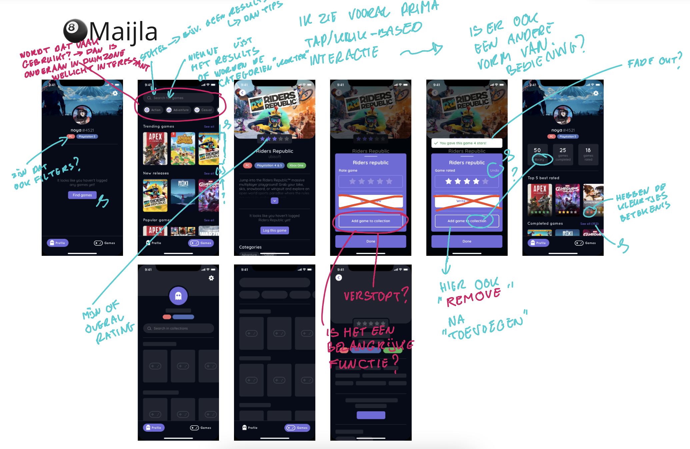
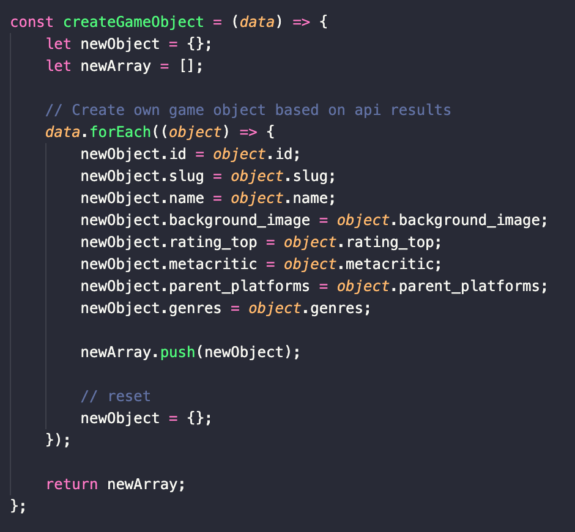
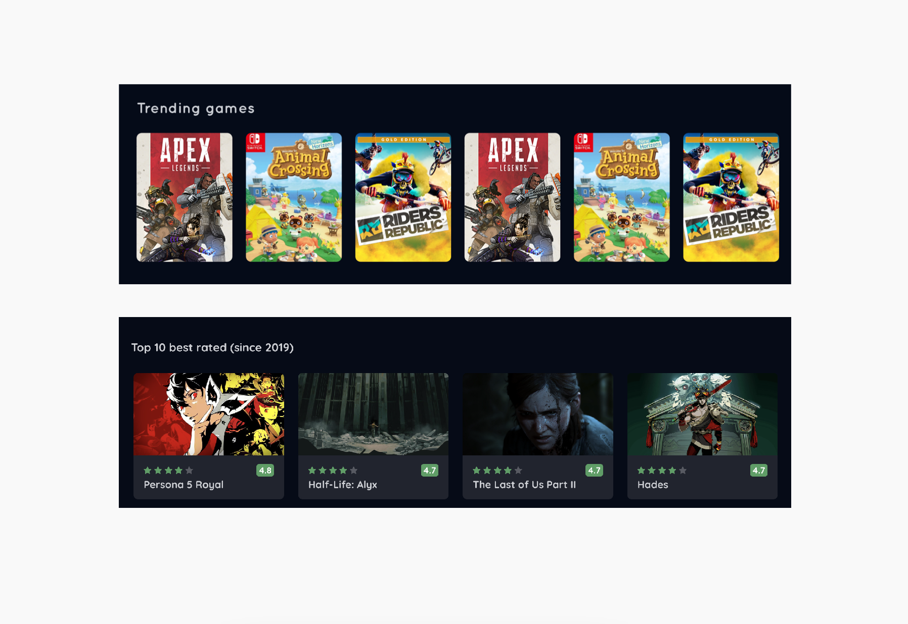
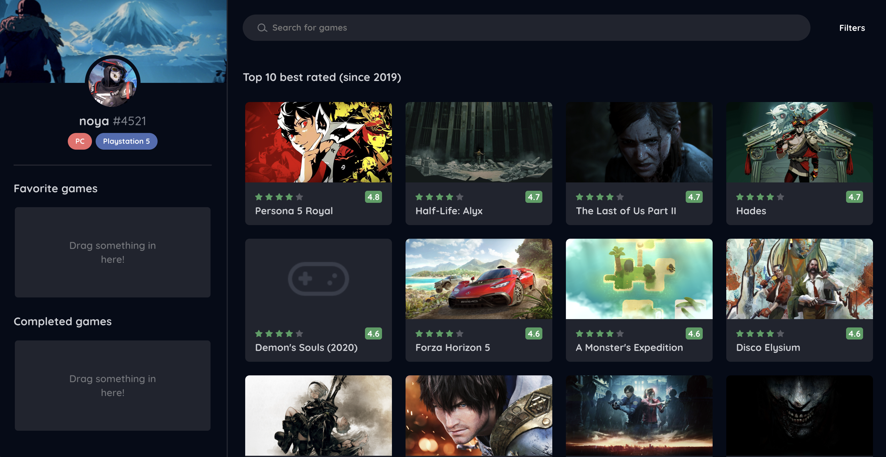

# Procesverslag
**Auteur:** Maijla Ikiz

**De opdrachten:** [opdracht 1](opdracht1/index.html) en [opdracht 2](opdracht2/index.html)

<!-- Markdown cheat cheet: [Hulp bij het schrijven van Markdown](https://github.com/adam-p/markdown-here/wiki/Markdown-Cheatsheet). -->

<!-- ## Bronnenlijst
  1. -bron 1-
  2. -bron 2-
  3. -...- -->

## Opdracht 1 plan

  
Uitwerken na schetsen idee (voor week 2)

  ### Mijn storyboards:
  Voor de eerste opdracht van Front-end voor Designers zal ik een logo gaan animeren in HTML/CSS. Hiervoor moest natuurlijk eerst een logo uitgekozen worden. Ik wist vrijwel direct al welk logo ik graag wou animeren, namelijk mijn persoonlijke logo! Ik had dit logo toevallig twee dagen voor de eerste les afgemaakt, en was al van plan om het te animeren voor mijn portfolio website. Dus deze opdracht sluit mooi aan.

  In de onderstaande afbeeldingen zijn twee verschillende storyboards te zien waarin ik laat zien hoe de animatie zal verlopen. Het logo is gemaakt met het idee dat het een soort programmeer/development logo moet zijn. Deze "vibe" wil ik ook terug laten komen door middel van de animatie.

  #### Typewriter animatie storyboard
  

  #### Curly brackets focused animatie storyboard
  

  ### Je ambitie: 
  Ik heb veel front-end ervaring, maar het animatie gedeelte daarvan is iets waar ik me nooit echt zelfverzekered in voel en het is ook iets wat ik niet vaak doe. Hier wil ik mij dus voornamelijk in verder ontwikkelen. Ik hoop daarom met deze opdracht mij verder te ontwikkel in vooral het werken met keyframes en de verschillende animatie mogelijkheden i.p.v. alleen een simpele zoom-in effect bijvoorbeeld. 
 

## Opdracht 1 reflectie

  
Uitwerken bij afronden opdracht (voor week 3)

  ### Je uitkomst - karakteristiek screenshot(s):
  

  ### Dit ging goed/Heb ik geleerd: 
  Door deze opdracht snap ik een stuk beter hoe animaties werken en hoe ik ze kan gebruiken in mijn projecten. Daarnaast was het interessant en leuk om mediaqueries voor `prefers-color-scheme` en `prefers-reduced-motion` te gebruiken. Voornamelijk `prefers-reduced-motion`, die kende ik nog niet! Soms vergeet je tijdens het coderen (uit enthousiasme :wink:) dat niet iedereen animaties even goed kan waarderen, dus goed dat dit ook ter sprake kwam tijdens de les!

  

  ### Dit was lastig/Is niet gelukt:
  Clip-path gebruiken! Ik kende het wel, maar had er niet veel mee gewerkt waardoor ik geen idee had hoe het eigenlijk werkte! (Weet het nu ook nog niet helemaal, ik pas het aan via de inspect hehe). Voor de rest had ik het niet zo lastig!

## Opdracht 2 plan

  
uitwerken na schetsen idee (voor week 4)

  ### Mijn case:
  Voor de tweede opdracht mocht er gekozen worden uit een aantal verschillende cases waarbij een one-pager gemaakt moest worden. Ik had gekozen voor de volgende case:

  > In een grote verzameling films wil ik een aantal leuke films kunnen bewaren om ze later te bekijken

  Zelf had ik wel een kleine aanpassing (met toestemming van de docent). In plaats van 'een grote verzameling films' zal ik een one-pager maken waarbij een verzameling van video games wordt getoond die vervolgens opgeslagen kunnen worden!

  ### Het ontwerp:
  

  ### Je ambitie: 
  Tijdens deze tweede opdracht hoop ik te leren hoe ik data kan ophalen vanuit een openbare API en hoe ik deze data vervolgens kan tonen aan de gebruiker. Daarnaast wil ik ook werken met drag & drop events.

## Opdracht 2 test

  
uitwerken na testen (week 6/7)

  Eerst had ik het idee om verschillende pagina's te hebben: profiel, video game bibliotheek en een overzicht van alle opgeslagen games. Ik kwam er snel achter dat dit niet alleen veel tijd zou kosten om te realiseren, maar ook dat het drag & drop principe nogal lastig te implementeren zou zijn als de drag container op een andere pagina was. Daarom heb ik het tijdens het programmeren het design aangepast in een one-pager waarbij het profiel van de gebruiker en de video game bibliotheek altijd te zien zijn.

  ### Probleem 1:
  Toen ik eenmaal tevreden was met mijn HTML en CSS, was het tijd om data uit een API te halen. Ik had al een tijdje een API in gedachte, maar om deze API te gebruiken was `OAuth` nodig.

  #### Oplossing:
  Ik ben een halve dag bezig geweest met het werkende krijgen van deze API, maar dit lukte niet i.v.m. CORS die niet wou meewerken.
  
  > Cross-Origin Resource Sharing (CORS) is an HTTP-header based mechanism that allows a server to indicate any origins (domain, scheme, or port) other than its own from which a browser should permit loading resources. - MDN Web Docs
  
  Omdat ik verder geen tijd meer wou verspillen ben ik gaan zoeken naar een andere video game API zonder `OAuth`. Uiteindelijk heb ik een andere API gevonden van [RAWG](https://rawg.io/apidocs) met 500,000+ video games.

  ### Probleem 2:
  Met hulp van een vriendin, die toevallig back-end developer is, heb ik de API aan de praat gekregen. Er was wel een probleem. De API ondersteund niet het selecteren van object attributen. Hierdoor kreeg ik ontzettend veel data binnen die ik eigenlijk helemaal niet nodig had.

  #### Oplossing:
  Omdat de API zelf het selecteren niet ondersteund, heb ik na het binnen halen van de data mijn eigen 'game object' gemaakt, met hierin de data die ik belangrijk vond en nodig had. Hierdoor wist ik ook wat een game object precies kon tonen.

  

  ### Probleem 3:
  Na het binnen halen van de data, en deze te kunnen tonen in de HTML, zag ik dat het probleem dit keer bij het ontwerp lag. De `background_image` die ik vanuit de API kreeg per video game, was niet een afbeelding die je op een fysieke copy van de game zou zien (staande afbeelding). In plaats daarvan was het een soort marketing screenshot van de game. Dit was niet slecht, maar het zag er niet mooi uit met mijn design.

  ### Oplossing:
  Doordat de `background_image` een liggende afbeelding was moest ik het design voor de cards aanpassen.

  

  ### Probleem 4 & 5:
  Tijdens het testen van de drag & drop functionaliteit liep ik tegen twee problemen aan. Een daarvan gebeurde tijdens het 'drop' event. Wanneer je iets in een drag container wou neerzetten wordt er gekeken naar welk element op dat moment als het ware geselecteerd wordt. In de meeste gevallen is dat gewoon het juiste element, namelijk de lijst (`ol`). Op het moment dat je al meerdere games in je lijst hebt opgeslagen, kan het soms zijn dat je de 'drag' loslaat op een game, oftewel een `li`, terwijl de gebruiker eigenlijk gewoon een `ol` bedoeld. 

  Het tweede probleem was dat een gebruiker dezelfde games in 1 lijst mocht hebben, wat natuurlijk niet kan!

  ### Oplossing:
  Om deze problemen op te kunnen lossen heb ik mijn drag & drop scripts een beetje moeten omgooien. Ten eerste wordt er nu gekeken naar welk element geselecteerd is op het moment van de drop. Als het niet een `ol` is, is het dus een `li` of een ander element binnen de `li` zelf. Door middel van `closest('ol')` kan ik vervolgens de collectie selecteren en er dus voor zorgen dat de `append` altijd in de correcte parent gebeurd.

  Voor het checken of de game al bestaat in de lijst voer ik gewoon een eenvoudige check uit door middel van het vergelijken van ids. Als er een match is, is de game al in de lijst! Door vervolgens een class te gooien op de `ol` kan ik voor een soort error message zorgen die aangeeft dat de game al in de lijst is.

## Opdracht 2 reflectie

  
uitwerken bij afronden opdracht (voor week 8)

  ### Je uitkomst - karakteristiek screenshot(s):
  

  ### Dit ging goed/Heb ik geleerd: 
  Ik heb geleerd hoe ik moet werken met APIs en drag & drop events! Het was interessant om ook na te denken over hoe het design op verschillende schermen zou werken. Ik moest daarvoor namelijk ook de HTML structuur correct opstellen.

  ### Dit was lastig/Is niet gelukt:
  Ik vond het jammer dat de API met `OAuth` niet gelukt was, het was een bekende API die veel news outlets gebruiken, en ze ondersteunde ook het selecteren van object attributen.

